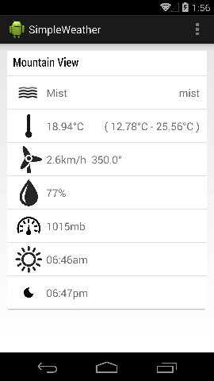

# Reactive SimpleWeather 





Reactive SimpleWeather is a demo android weather app utilizing latest android open source technologies and api services, it is built with latest Android Studio Beta and gradle.


### [OpenWeatherMap Web API](http://openweathermap.org/api)

Reactive SimpleWeather is fetching local weather based on geo location from [OpenWeatherMap.org](http://openweathermap.org/), you
can fetch your current local weather data using the longitude and latitude, the result would be like:

```javascript
{ "coord":   {"lon":-122.08, "lat":37.41},
  "sys":     {"type":1, "id":451, "message":0.4839, "country": "United States of America", "sunrise":1406812347, "sunset":1406863010},
  "weather": [{"id":802,"main":"Clouds","description":"scattered clouds","icon":"03d"}],
  "base":    "cmc stations",
  "main":    {"temp":296.81,"pressure":1015,"humidity":77,"temp_min":288.15,"temp_max":303.15},
  "wind":    {"speed":2.6,"deg":0},
  "clouds":  {"all":40},
  "dt":      1406833786,
  "id":      5375480,
  "name":    "Mountain View",
  "cod":     200
}
``` 


### [Retrofit](http://square.github.io/retrofit) integrated with [RxJava](https://github.com/Netflix/RxJava)

Following [Functional Reactive Programming Paradigm](http://en.wikipedia.org/wiki/Functional_reactive_programming), Reactive SimpleWeather uses [Retrofit](http://square.github.io/retrofit) integrated with [RxJava](https://github.com/Netflix/RxJava) to fetch weather data asynchronously. 

You can find more about using Retrofit with RxJava in this [Netflix OSS Presentation](http://www.slideshare.net/RuslanMeshenberg/netflixoss-season-2-episode-2-reactive-async) 


### [Card Library](https://github.com/gabrielemariotti/cardslib)

Finally, Reactive SimpleWeather is rendering current weather in a UI Card using [Card Library](https://github.com/gabrielemariotti/cardslib), it is similar to the UI Style of the latest Google Now.

 


 
